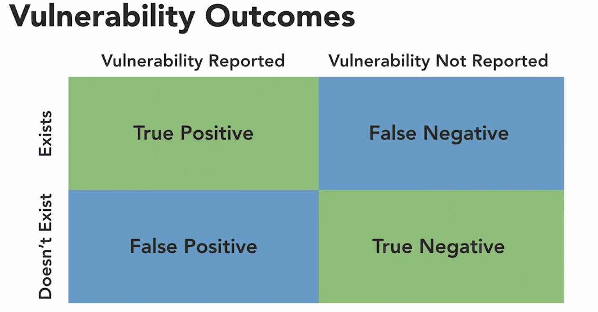
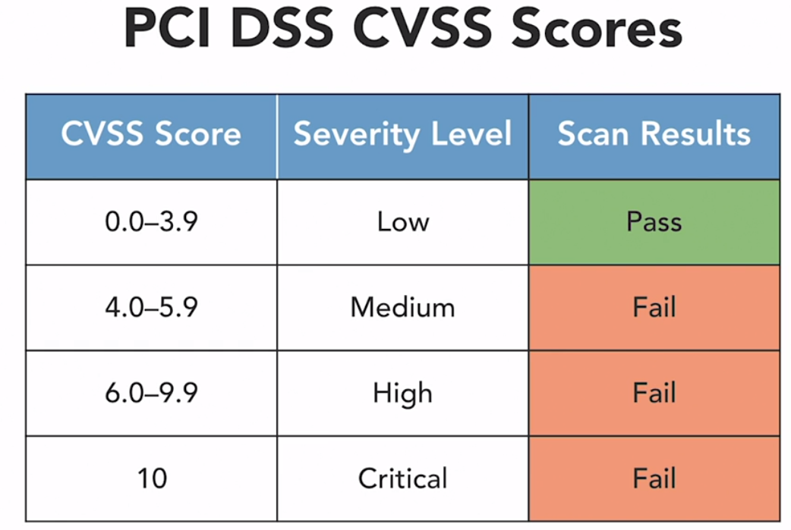

#### Threats, Attacks and Vulnerabilities 

**1. Malware**
* Viruses (Spread by medium), Worms (Spread by themselves) and Trojans (Disguise as legitimate software) 
    - The RTM Worm : Robert T. Morris (1988)
    - Stuxnet Worm 
    - Remote Access Trojans (RAT)
* Propagation Mechanism: the way that a malware object spreads 
* Payload : the malicious action that the malware performs 
* Understanding Backdoors and logic bombs 


**2. Understanding Attackers**
* Internal vs external attackers 
* Level of sophistication, access to resources, motivation, intent
* Script Kiddies, Hacktivists, Criminal Syndicates, Competitors (corporate espionage), Nation-state (Advanced persistent threat-APT)
* White Hats, Black Hats, Grey Hats 
* Insider Threats, Privilege Escalation Attacks
    - Background Checks 
    - Least Privilege: give users only the permissions that they need 
    - require mulitple users to carry out sensitive operations 
* Shadow IT : use of unapproved technology services 
* Attack Vectors : Provide an attack Path 
    - Email : phising and malicious content 
    - Social Media : spread malware and be used as part of an influence campaign 
    - Flash Drives and other removable media 
    - USB cables with embedded chip 
    - Card skimmers : magnetic stripes which may then be used in card cloning attacks
    - Cloud services : Scan for improperly secured content and systems 
    - Direct access to systems 
    - Supply Chain tampering and insert backdoors 
    - wireless networks access 
* Zero days and the advanced presistent threat
    - Patches for vulnerabilities 
    - Ethical Disclosure 
        - Notify the vendor of the vulnerability 
        - Provide the vendor a resonable amount of time to create a patch 
        - Disclose the vulnerability publicly 
    - Zero-Day Vulnerability 
    - Window of Vulnerability : the time between the discovery of a zero-day vulnerability and the release of a security update 
    - APT 
        - well-funded and highly skilled 
        - typically government sponsored 
        - access to zero days and other sophisticated weapons 
        - work methodically to gain access to a target 
    - Defending against APTs 
        - build a stron security foundation
        - implement strong encryption 
        - use rigorous monitoring 

**3. Threat Intelligence** 
* set of activities that an organization undertakes to educate itself about changes in the cybersecurity threat landscape, and adapt security controls based upon that information 
* Open-Source Intelligence (use public information)
    - security websites 
    - vulnerability databases 
    - News media 
    - social media 
    - dark web 
    - information sharing centers 
    - file repositories 
    - code repositories 
    - security researchers 
* Email Address Harvesting : searches for valid addresses 
* Timeliness : how promptly is threat intelligence delivered ?
* Accuracy: Is the data correct ?
* Reliability: Is the provider consistent ? 
* Threat Indicators: Properties that describe a threat 
    - Cyber Observable eXpression(CybOX)
    - Structured Threat Information eXpression(STIX)
    - Trusted Automated eXchange of Indicator Information (TAXII)
    - OpenIOC: mandiant threat framework 
    - TAXXI, STIX and CybOX facilitate information sharing 
* Functions Supported by Intelligence 
    - Incident response 
    - Vulnerability Management 
    - Risk Management 
    - Security Engineering 
    - Detection and monitoring 
* ISACs : Information Sharing and Analysis Centers 
* Reputational Threat Research : identify potentially malicious actors based upon their use of IP address, email address, domains etc that were previously used in attacks 
* Behavioral Threat Research : identify potentially malicious actors based upon the similarity of their behaviors to past attackers 
* Research Sources 
    - Vendor websites 
    - Vulnerability Feeds 
    - Cybersecurity Conferences 
    - Academic journals 
    - RFC documents 
    - Local Industry Groups 
    - Social Media 
    - Threat Feeds 
    - Adversary tactis, techniques, and procedures (TTP)
* Threat Modeling : identifies and prioritizes threats 
    - Structured approach to threat management 
        - Asset Focus : use the asset inventory as the basis for the analysis 
        - Threat Focus : identify how specific threats may affect each information system 
        - Service Focus : identify the impact of various threats on a specific service 
* Automating threat intelligence 
    - Automate the blacklisting of IP addresses from threat feeds 
    - Automation may cause disruption so, alert only feature can be enabled initially to determine the possible IP that could be blocked 
    - Combine different threat feeds for more robust filtering 
* Data Enrichment 
    - Automatically supplements incident data 
* Sample Data Enrichment Tasks
    - Perform source address reconnaissance 
    - Retrieve related log records 
    - Trigger a vulnerability scan 
* Security Orchestration, Automation, and Response (SOAR) platforms enhance SIEM capabilities 
* Machine Learning : allows the automated creation of malware signatures 
* Threat hunting 
    - An organized, systematic approach to seeking out indicators of compromise on our networks using expertise and analytic techniques 
    - Begin by establishing a hypothesis 
    - Indicator of Compromise 
        - Unusual binary files 
        - Unexpected processes or resource consumption
        - Deviation in network traffic 
        - Unexplained log entries 
        - Unapproved configuration changes 
    - After discovering a compromise move into incident response 

1. Basic principle underlying threat hunting activities ==> assumption of compromise 
2. Best assists with the automation of security workflows ==> SOAR 
3. STIX is a standardized language used to communicate security information between systems and organizations 

**4. Social Engineering Attacks**
* Authority 
    - People defer to authority 
    - Shock 
* Intimidation : scaring people 
* Consensus 
    - Social proof 
    - The herd mentality 
* Scarcity 
    - Getting the last one 
* Urgency 
    - Time is running out 
* Familiarity 
    - liking 
* Spam
    - Unsolicited commercial email (UCE) 
    - phising subcategory of spam 
    - prepending attacks seek to impersonate security filters 
    - Spear phishing: targeted attack 
    - Whaling: targeted attacks on executives 
        - Subpoena fake court orders 
    - Pharming :using fake websites, typosquatting, dns poisoning 
    - Vishing : voice phishing 
    - Smishing and SPIM : SMS and IM spam
    - Spoofing: faking an identity 
* Pretexting Attacks: impersonating a customer 
* Watering hole: (animal gathering for water)
    - users trust the websites they visit, to some extent 
    * browsers and add-ons often have vulnerabilities 
    * Client side vulnerabilities 
    * Users are conditioned to click OK on security warnings 
    * Black listing blocks known malware sites 

* How a watering hole attack works 
    1. identify and compromise a highly targeted website 
    2. choose a client exploit and bundle in a botnet 
    3. place the malware on the compromised website
    4. Sit back and wait for infected systems to phone home 

* Shoulder surfing, dumpster diving, tailgating, 

*Q1. What type of website does the attacker use when waging a watering hole attack ? => Site trusted by the end user*

*Q2. In what technique do attackers pose as their victim to elicit information from third parties ? => pretexting*

**5. Common Attacks**
* Password attacks  
    - /etc/passwd: password file in linux
    - /etc/shadow: Shadow file can only be accesed by superuser 
    - hash function: mathematical function that converts a variable-length input into a fixed-length output 
        - must produce a completely different output for each input 
        - must be computationally difficult to retrieve the input from the output 
        - must be computationally difficult to find two different inputs that generate the same output (collision)

    - **The Birthday Problem**
        - Collisions become common with large samples 
    
    - Cracking passwords 
    - Brute force attacks: try all possibilities
    - Dictionary Attacks 
    - Hybrid Attacks: add varitions to tries 
    - Rainbow Table Attack : Precomputes hashes 

    ```
    $ sudo useradd matt
    $ sudo passwd matt 
    $ sudo ./unshadow /etc/passwd /etc/shadow > passwords(file-name)
    ```

* Password spraying and credential stuffing 
    - Exploit common passwords 
    - Possible because of reused passwords 
    - MFA 

* Machine Learning 
    - Discover knowledge in Data 
    - Simulate human thought 
    - Predictive analytics 
    - Prescriptive analytics : simulation to optimize our behavior
    - Adversarial AI : Exploit AI techniques 
        - breach confidentiality of machine learning algorithms 
        - inject tainted data into training processes 
        - fool deployed algorithms 

*Q1. Dan is engaging in a password cracking attack where he uses precomputed hash values. What type of attack is Dan Waging ? ==> Rainbow Table*

**6. Understanding Vulnerability types**
* Vulnerability Impact 
    - CIA (confidentiality, Integrity, Availability)
    - Data breach are violations of confidentiality 
    - Data exfiltration removes sensitive information from an organization's control 
    - DDoS attacks seek to undermine availability 
    - Financial risks, Reputational risk, Strategic risk : jeopardizes the ability to meet major goals and objectives 
    - Operational risk affects the ability to carry out day-to-day activities 
    - Compliance risk : potential violations of laws or regulations 

* Supply Chain vulnerabilities 
    - End of Life announcement
    1. End-of-sale : product will no longer be offered for purchase but the vendor will support existing customers 
    2. End-of-support : vendor will reduce or eliminate support for existing users of the product 
    3. End-of-life : the vendor will no longer provide any support or updates for the product 

* Configuration vulnerabilities 
    - defaults passwords, or  unsecured root accounts 
    - cryptographic vulnerabilities 
        - weak cipher suites 
        - weak cryptographic protocol implementations 
        - poor key management 
        - poor certificate management 
        - Patch management 
            - Operating systems, application, firmware
        - Account management : permissions assigned to accounts to prevent accidental or intentional misuse 
        - Least Privilege: limit user permissions 

* Architectural vulnerabilities 
    - IT architecture: processes and practices used to design system 
    - Incorporate Security early, avoid bolt-on security requirements 
    - System Sprawl: new devices are connected to a network, but old devices are not promptly disconnected, leading to security vulnerabilities 
    - System sprawl is even more risky when assets are undocumented 

*Q1. Data breaches violate confidentiality*

**7. Vulnerability Scanning**
* Vulnerability management : detects, remediates and reports vulnerabilities 
    - Linux kernel contains over 24 million lines of code 
    - thousands of lines change everyday 
* Vulnerability Patching Process
    1. the company learns of a vulnerability 
    2. developers analyze the issue and develop a patch 
    3. the company releases the patch to customers 
    4. Customers apply the patch to remediate the vulnerability 
* Why manage vulnerabilities ? 
    - Maintain system security 
    - comply with corporate policy 
    - comply with regulatory requirements 
    - **PCI DSS Requirements**
        - conduct quartely internal and external vulnerability scans 
        - repeat scans after any significant change 
        - use an approved scanning vendor (ASV)
        - remediate and rescan until you achieve a clean report 
    - **FISMA Requirements**
        - Conduct vulnerability scans regularly 
        - Analyze the results of scans 
        - Remediate legitimate vulnerabilities 
        - Share information with other agencies 
* Network Vulnerability Scans 
* Application Scans 
* Web Application Scans 
* Supplement vulnerability scans with configurations and log reviews (for false positives)
* Asset inventory : provides the starting point for vulnerability scanning 
* **Nessus**, **Qualys** 
* Impact, what is the highest data classification handled by the system 
* Likelihood, what is the network exposure , what services are exposed 
* Criticality : what impact does the system have on business operations ? 
* Network location affects scan results 
* Firewall settings, IDS/IPS rules and network segmentation all impact scan results 
* Agent-based scanning: installs software on each target device 
* Credentialed Scanning : uses password to log into system 
* Severe, Critical, Urgent 
* SCAP - Security Content Automation Protocol 
    - SCAP components 
    1. Common Vulnerability Scoring System (CVSS)
    - Scores vulnerabilities on a 10-point scale 
    - Metrics used to determine the scale 

    *Attack Vector(AV)*
    |Rating | Description|
    |-------|---------|
    | Physical (P) | Physical touch/manipulation is required|
    |Local(L)| Physical or logical console access is required|
    |Adjacent Network(A)|Local network access is required |
    |Network (N) | Remotely exploitable vulnerability | 

    *Attack Complexity (AC)*
    |Rating|Description|
    |----------|------------|
    |High (H)| Requires specialized conditions|
    |Low(L) | Does not require specialized conditions|

    *Privileges Required (PR)*
    |Rating|Description|
    |--------------|--------------|
    |High(H)| Requires administrative control|
    |Low(L) | Requires basic user privileges |
    |None(N)| Requires no prior privileges|

    *User Interaction (UI)*
    |Rating|Description|
    |-------|-------|
    |Required(R)| Requires that a user take some action|
    |None(N)| Does not require user interaction|


    * The AV,AC, PR and UI metrics combine to describe the exploitability of a vulnerability 
    
    *Confidentiality (C)*
    |Rating|Description|
    |-----|------|
    |None(N)| No confidentiality impact|
    |Low(L)|Access to some information is possible|
    |High(H)| All information is compromised|

    *Integrity (I)*
    |Rating|Description|
    |------|------|
    |None(N)|No integrity impact|
    |Low(L)|Modification of some information is possible |
    |High(H)| All information is compromised|

    *Availability (A)*
    |Rating|Description|
    |------|-----|
    |None(N)| No availability impact |
    |Low(L)| Performance is degraded|
    |High(H)|The system is shut down|

    * The C, I , A metrics combine to describe the impact of a vulnerability 

    *Scope(S)
    |Rating|Description|
    |------|------|
    |Changed(C)| Exploiting the vulnerability can affect other components|
    |Unchanged(U)| Exploiting the vulnerability only affects resources managed by the same security authority|

    2. Common Configuration Enumeration (CCE)
    3. Common Platform Enumeration (CPE)
    4. Common Vulnerabilities and Exposures (CVE)
    5. Extensible Configuration Checklist Description Format (XCCDF)
    6. Open Vulnerability and Assessment Language (OVAL)

* Analyzing Scan reports 
    - Prioritization Factors 
        1. Vulnerability Severity 
        2. System Criticality 
        3. Information Sensitivity 
        4. Remediation difficulty 
        5. System Exposure 

* Vulnerability Validation 
    - Confirms accuracy 
    - Is the report a false positive ? 
    
    

* Correlating Scan Results 
    - Consult industry standards, best practices and compliance requirements 
    - PCI DSS CVVSS Scores 

    

    - Technical Information sources 
        - Configuration Management Systems 
        - Log Repositories 
        - Other Data Sources 

    - Trend Analysis (Tenable Security Center)    

*Q1. As Dave works with his colleagues in other IT disciplines, he notices that they use different names to refer to the same products and vendors. Which SCAP component would best assist him in reconciling these differences? => Common Platform Enumeration (CPE)*

*Q2. Helen has vulnerability scanners located at several points on her network. Which one of the following scanners is likely to provide the most complete picture of the vulnerabilities present on a public web server? => DMZ Scanner*

*Q3. Renee is creating a prioritized list of scanning targets. Which one of the following is the least important criteria for her prioritization? => Operating System options: Network Exposure, Information Sensitivity, Services installed*

*Q4. What CVSS value is the threshold at which PCI DSS requires remediation to achieve a passing scan? => 4*

**8. Penetration Testing and Exercises**
* The goal of a penetration test is to successfully defeat security controls 
* Rules of Engagement (ROE) before begining a pen test 
* White Box : Attackers have full access to information before they begin the test 
* Black Box : Attackets have no information about the target before they begin the test (simulating external attack)
* Grey Box: Attackers have limited information before they begin the test 
* NIST 
    - Discovery Phase --> Attack Phase[ Gaining Access --> Escalating privileges --> system Browsing (Lateral movement) --> Install Additional Tools]
    - Warflying takes wardriving to the air with drones and UAVs 
    
    |Pivot| Persistence|
    |-----|-----|
    | After exploiting a vulnerability in a system, attackers use that system as a base from which to target other systems on the same local network| After exploiting a vulnerability in a system, attackers install tools on that system to allow future access- even if the initial vulnerability is corrected | 

* Clean up at the end of the test 

* Bug Bounty 
    - Open Security testing 
    - self-managed and fully-managed bounty programs 

* Cybersecurity exercises may use competitive format 
    - identify vulnerabilities in system 
    - provide participants with hands-on experience attacking and securing system
    
    |Red Team| Blue Team | White Team|
    |------|------|--------|
    | Attackers who will try to undermine security | Defenders who will secure the systems from attack| Observers and judges who manage the exercise |

* Purple Team
    - Combines knowledge from the red and the blue team during a lessons-learned session after the exercise 
* Setting up a sandbox environment for cybersecurity exercises limits the risk to production systems 
