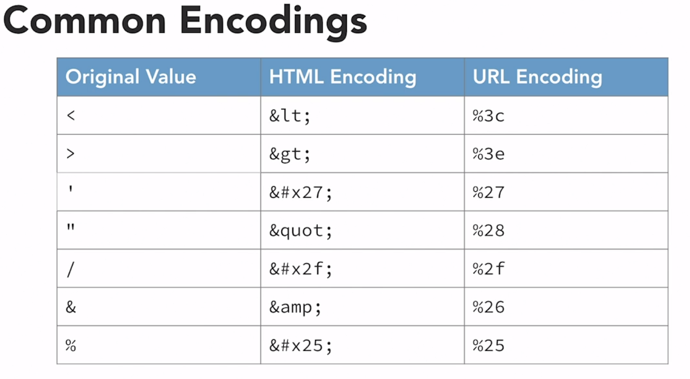
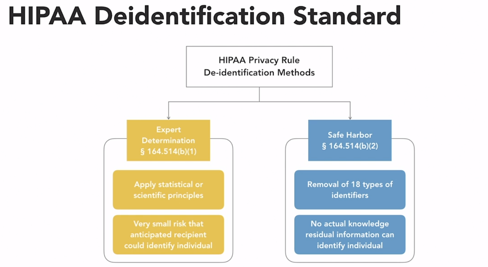

### Domain 2
### Secure Code Design and Implementation 

**1. Software Development Lifecycle**
* Software platform
    - Endpoint Applications : self-contained on a device 
    - Client/Server Apps : Interact with a server 
        - Database driven application 
        - Web Applications 
    - Mobile endpoints 
    - Embedded devices power the IoT 
* Development Methodologies 
    - must incorporate security at every steps 
    - business requirements and translate them into a design 
    - Waterfall Model 
        - system requirements -> software requirements -> Preliminary Design -> Detailed Design -> Code and Debug -> Testing -> Operations and Maintenance 
        
    - Sprial Model
        - Begin -> Determine Requirements -> Risk Assessment -> Development and Testing  
    
    - Manifesto for Agile Software Development 
    
* Maturity Models  
    - Provide standard benchmarks 
    - The Capability Maturity Model Integration(CMMI) assesses an organization's process maturity 
        1. Initial
        * Work gets done but is subject to delays and budget overruns 
        
        2. Managed
        * Configuration Management 
        * Measurment and analysis 
        * Project monitoring and control
        * Project planning 
        * Process and product quality assurance 
        * Requirement management 
        * Supplier agreement management 

        3. Defined
        * Decision analysis and resolution 
        * Integrated project management
        * Organizational process definition 
        * Organizational training 
        * Organizational process focus 
        * Product Integration 
        * Requirements development  
        * Risk Management 
        * Technical Solution 
        * Validation 
        * Verification 

        4. Quantitatively Managed 
        * Organizational process performance 
        * Quantitative project management 

        5. Optimizing 
        * Causal analysis and resolution
        * Organizational performance management 

    - IDEAL Model 
        - Initiating Diagnosing Establishing Action Learning 

* Change Management 
    - Request Control
        - Manages, evaluates and prioritizes inbound requests from customers 

    - Change Control
        - Grants permission for developers to make changes to application code 

    - Release Control 
        - Moves the code from the develpment environment into production

    - Code Environments 
        - Development Environment  ---> Test Environment  ---> Staging Environment --> Production Environment 

* Automation and DevOps 
    - DevOps Goals 
        - Build collaborative relationships 
        - Embrace automation 
        - Facilitate rapid release of code 
    - DevOps and Agile are related: both seek continuous integration 
    - Infrastructure as Code : Scripts the creation of resources 
    - Advantages 
        - Increases scalability of environments 
        - Reduces user error 
        - Facilitates testing of new code 
    - DevOps facilitates security automation 

    - DevOps Tools 
        - Continuous validation 
        - Continuous Integration 
        - Continuous delivery 
        - Continuous deployment 
        - Continuous monitoring 

*DecSecOps applies DevOps techniques to a cybersecurity program*

*Q1. What phase of the capability maturity model introduces the reuse of code across projects? => Managed*

*Q2. What component of a change management program includes final testing that the software functions properly? => Release Management*

**2. Software Quality Assurance**
* Software is one of the most common sources of security vulnerabilities 
* Code Review : use peer analysis to assess code 
* Fagan inspection
    - Planning, overview, preparation, meeting, rework, follow-up
* Verification and validation 
    - Software model validation : Are we building the right software ? 
    - Software verification : Are we bulding the software right ?
* Stress testing 
    - uses automated scripts to verify system capacity 
    - may be run internally or through a vendor 
    - verifies the system can handle the maximum expected load 
    - determines the maximum capacity of the system 
* User Acceptance Testing (UAT)
    - Ensures software will woirk for users 
    - UAT is commonly referred to as beta testing 
* Regression Testing 
    - checks for unexpected side effects 
* Code security testing checks software for application security flaws 
* Code Security Tests : use technology to inspect software 

|Static Tests | Dynamic Tests | 
|------|-------|
| Use automated techniques to analyze code for errors and security flaws without actually executing it | Execute code to verify that it is functioning correctly and doesn't have security flaws |

* Sythentic transactions supply inputs to code with known, expected outputs 

*Code reviews, static testing and dynamic testing are complementary rather then competitors*

* Fuzzing : Software testing technique that feeds software many different input values in an attempt to cause an unpredictable state or unauthorized access 
* Fuzz testing input sources 
    - Developer-supplied input
    - Developer-supplied script 
    - Generation fuzzing 
    - Mutation fuzzing 

**OWASP Zed Attack Proxy (ZAP)**

* Avoid looking like a hacker : Only fuzz test with permission 
* Code repositories
    - store software source code files 
    - coordinate changes among multiple developers 
    - perform version control 
    - promote code reuse 
* code repositories help to avoid dead code 

* Secure provisioning and deprovisioning of applications ensures the integrity of released code 
* Integrity Measurement : verifies release code is unchanged using hash value 
* Application Control : Restricts software that may run 

|Whitelisting | Blacklisting|
|-----|------|
|Administrators create a list of all the application that may run on a system | Administrators create a list of the applications that are prohibited on a system | 

* Windows GPL (Group Policy Management)
    - Application Control Policies 
        - Executable Rules 
        - Windows Installer Rules 
        - Script Rules 
        - Packaged app Rules 

* Integrate application control logs with your SIEM 
* Host Software Baselining : identifies expected system software 
* Third-party libraries 
* Software Development Kits (SDKS) : provide programming resources 
* Application Programming Interfaces (APIs)

*Q1. What type of fuzz testing captures real software input and modifies it? => Mutation fuzzing*
*Q2. What is the name of the application control technology built-in to Microsoft Windows? => AppLocker*
*Q3. Libraries consist of shared code objects that perform related functions*
*Q4. What is the first step of a Fagan inspection? => Planning*

**3. Application Attacks**
* OWASP Top 10 
    1. Broken Access Control : Allows unauthorized access 
    2. Cryptographic Failure : Allows access to sensitive data 
    3. Injection Flaw : Inserts unwanted code 
    4. Insecure Design : Fails to meet security requirements 
    5. Security Misconfiguration : Occurs in many possible locations 
    6. Vulnerable components : can jeopardize application security 
    7. Authentication Failure : Exploits session management 
    8. Integrity Failure : Allow insertion of insecure code 
    9. Monitoring and log failure : Can deprive analyst of needed data 
    10. Request Forgery : Tricks servers into requesting URLs

* The CWE Top 10
* Center for Internet Security 

|Purchased Software| Developed Software |
|--------|----------|
|Acquired from software vendors for use in many different organizations | Custom written to meet the specialized needs of a single organization|

* Application Hardening 
    - Use Proper authentication
    - Encrypt sensitive data 
    - Validate user input 
    - Avoid and remediate known exploits 
    - Deploy obfuscation and camouflage 

* Prompt patching is critical : attackers quickly exploit new vulnerabilities 
* Application Configuration 
    - Type and scope of encryption
    - Users with access to the application
    - Access granted to authorized users 
    - Security of underlying infrastructure 

* Configuration baselines allow quick identification and remediation of security gaps 
* SQL injection 
* Database-Driven Authentication 

| Input Validation | Parameterized SQL |
|----------|------------|
| Protects against unsafe user input by checking it on the server before executing commands | Precompiles SQL code on the database server to prevent user input from altering query structure | 

* Cross-Site Scripting  (XSS)
    - Occur when an attacker embeds malicious scripts in a third-party website that are later run by innocent visitors to that site 

* HTML Tags
* User input validation , don't allow `<script>` tags in user-supplied input 

* Cross-site request forgery, CSRF, XSRF, and "sea surf" all refer to the same attack 
    - leverage the fact that users are often logged into multiple sites at the same time and use one site to trick the browser into sending malicious requests to another site without the user's knowledge 
    - XSRF secretly sends requests : often using image tags 
    - Rearchitect web applications 
    - Prevent the use if HTTP GET requests 
    - Advise users to logout of sites 
    - Automatically log out users after an idle period 
    - CSRF is a client side attack 
    - Server-Side Request Forgery (SSRF)
        - request forgery attack that targets servers, rather than users, by manipulating servers into retriecing malicious data from what it believes to be a trusted source 

* Directory Traversal Attacks : allows an attacker to manipulate the web server's file structure 
* Quick Facts about UNIX filesystems 
    - .references the current directory 
    - .. references the directory one level up

* **WEBGOAT**

* Overflow attacks 
    - Use input larger than the buffer 

* Cookies and attachments 
* Locally Shared Ojbects (LSO)
* Cookie provide an easy shortcut for web authentication 
* Guessable Cookies : Jeopardize Security 
* Header manipulation 

|Cookie Guessing | Session Replay |
|---------|-----------|
| Possible if cookie values are not randomly generated | Possible if cookie values are not encrypted in transit |

* Secure Cookies : Sent using encryption 

* Code Execution Attacks : Occur when an attacker exploits a vulnerability in a system that allows the attacker to run commands on that system 
* **Arbitrary code execution**
    - Code execution attacks where the attacker runs commands of his or her choice 
* **Remote Code Execution**
    - Code execution attacks that take place over a network connection 

* Code Execution Objectives   
    - Instll malicious code 
    - Join a system to a botnet 
    - Steal sensitive information 
    - Create accounts for later access 
* Limit administrative access 
* Patch systems and applications 

* Privilege Escalation Attack : Gains administrative access 
    - Often exploit buffer overflow vulnerabilities 

* Mitigating Privilege Escalation 
    - Perform input validation 
    - Patch operating systems, platforms, and applications 
    - Enforce the least privilege principle 
    - Use DEP :Data Execution Prevention and ASLR: Address Space Layout Randomization technologies 

* Driver Manipulation
    - require low-level access to the operating system
    
    | Refactoring | Shimming|
    |-----|-----|
    | Modifying a driver to carry out malicious activities | wraps a legitimate driver with a malicious shim | 
    | Requires access to the driver source code | Does not require access to the legitimate driver's source code | 

* Code signing protects against malicious drivers 

* Memory management provides secure, isolated memory for each system process 
    - Memory overflow : allows arbitrary code execution 
    - Resource exhaustion may slow down or disable a system 
    - Memory leak : fails to release memory for reuse 

* Memory Pointers 
    - Following a pointer is known as pointer dereferencing 
    - Null pointer dereferencing : null pointer exception 

* DLL (Dynamically linked Libraries) Injection 
    - Tricks an application into loading malicious code 

* Race Conditions 
    - Occurs when the proper functioning of a security control depends upon the timing of actions performed by the user or computer 
    - Uncontrolled race conditions can be significant security vulnerabilities 
    - Time of Check/Time of Use     
        - Time elapsing between authorization and the action 
    - Locks prevent simultaneous transcations from causing race conditions 
    
*Q1. What attack technique wraps malicious code around a legitimate driver ? => Driver Shimming*

*Q2. What condition occurs when a software package fails to release memory that it reserved for use? => Memory leak*

*Q3. Which of the followign is a race coindition attack ? => TOC/TOU*

*Q4. Which one of the following is not a standard application hardening technique? => Conduct Cross-site scripting*

*Q5. Which one of the following is not an effective defense against XSRF attacks? => network Segmentation, options: user education, preventing the use of HTTP GET requests, automatic logouts*

**4. Secure Coding Practices**
* Input Validation 
    1. Whitelisting : Specifies allowable input, not always practical 
    2. Blacklisting : Specifies disallowed input, more difficult and less effective than whitelisting 
* Input validation should always be performed on the server 

* Parameterized query 
    - Stored Procedures 

    ```
    CREATE PROCEDURE spCustomerState(@State AS VARCHAR(max))
    AS 
    SELECT *
    FROM Customers
    WHERE CustState = @State

    EXEC spCustomerState 'TX'
    ```

* Authentication and session management issues 
    - Never Stop passwords in plaintext form 
    
    | Hashing | Salting |
    |-----|-----|
    | Uses a cryptographic function to transform the password into a unique value that can't be reversed | Adds a random value to passwords prior to hashing to protect against rainbow table attacks |

    - Encrypt password in transit 

    - Transport Layer Security : encrypts web traffic 

* Output Encoding : Replaces dangerous characters 
    
    | HTML Encoding | URL Encoding |
    |---------------|--------------|
    | Uses "&" notation to replace dangerous values that appear in an HTML-based web document | Uses "%" notation to replace dangerous values that appear in a URL | 

    - Use trusted libraries to perform output encoding 

    

* Error and Exception handling 
    - State Diagram 
    - Unpredicatable states jeopardize application security 

* Code Signing 
    - Provides user with confidence that software comes from a trusted source 
    - Digital Signatures provide nonrepudiation 
    - Applies digital signatures to software 
 
    1. The developer obtains a digital certificate 
    2. The developer creates a digital signature for the code using the private key associated with the certificate 

* Verifiying Code Signatures
    1. The user downloads the software 
    2. The operating system uses the certificate's public key to validate the signature 
    3. The OS verifies that the signature's hash matches the code 
    4. The OS verifies that the developer is trusted 

* Database Security 
    - Database Normal Forms : Design rules for columns and tables 
    - Why Normalize ? 
        - Prevent data inconsistency 
        - Prevent update anomalies 
        - Reduce the need for restructuring existing databases 
        - Make the database schema more informative 
        - 1NF, 2NF, 3NF
        - Use encryption to protect sensitive data stored in a database 
        - obfuscation and camouflage hide the locations of sensitive information 
    - Database Activity Monitoring 
        - Logs and analyzes database requests 
    
    - Stored Procedures : Protect against SQL injection 

* Data deidentification 
    - Organizations minimize risk by removing identifying information from datasets 
    - Removes obvious identifiers 
    
    - Anonymization : Remove the possibility of identification 

* **HIPPA Deidentification Standard**


* Data Obfuscation 
    - Transform personally identifying information into a form where it is no longer possible to tie it to an individual person 
    - Hashing: replaces sensitive fields with hash values 

    - Rainbow Table Attack : Compares hash values with precomputed hashes 

    - Salting : Uses random values to defeat rainbow tables 

    - Tokenization : Replaces sensitive fields with a random identifier 

    - Masking : Redacts sensitive information from a file 

*Q1. Database normalization should always be used to improve database security. => FALSE*
*Q2. What data obfuscation technique is intended to be reversible? => Tokenization*
*Q3. What input validation approach works to exclude prohibited input? => Blacklisting*
*Q4. Which one of the following technologies is an example of a parameterized query? => Stored Procedure*
