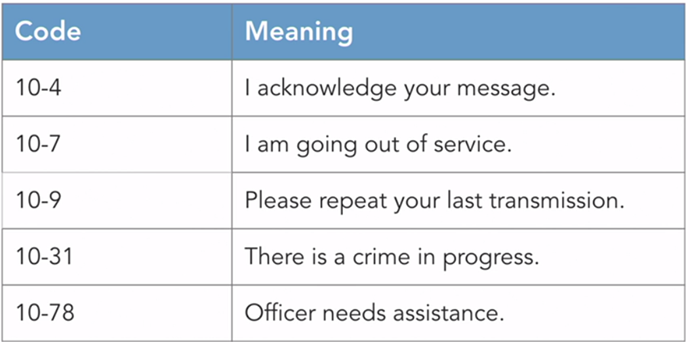
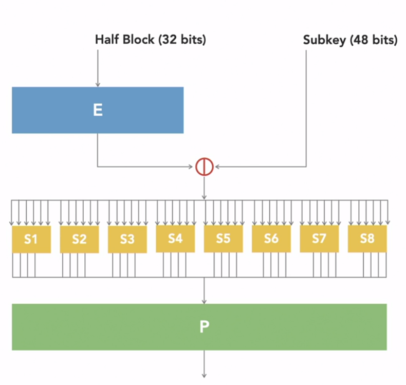
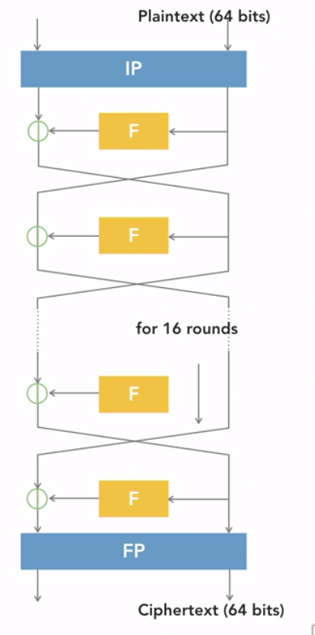
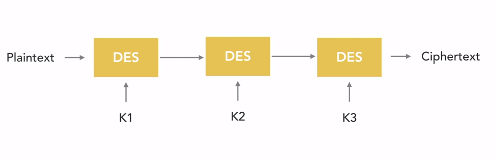

#### Domain 3 
### Cryptography Design and Implementation 

**1. Encryption**
* Protects sensitive information from unauthorized disclosure 
* Cryptography: The use of mathematical algorithms to transform information into an encrypted form that is not readable by unauthorized individuals 
* Encryption : converts information from plaintext form into ciphertext 
* Decryption: Converts ciphertext messages back into their plaintext form 
* Symmetric Encryption : Encryption and decryption use the same secret key 
    
* Asymmetric Encryption: Encryption and decryption use different keys from the same pair 

* Goal of Cryptography 
    1. Confidentiality : No unauthorized access 
        - Data at Rest : stored on a hard drive or other storage 
        - Data in Transit : Transmitted over a network connection 
        - Data in Use : Processed actively in memory 

    2. Integrity : No unauthorized changes 
    
    3. Authentication : Proof of identity claims 

    4. Obfuscation : Hiding sensitive data 

    5. Non-Repudiation : Verification of Origin
        - Digital Signature provides non-repudiation 
        - Non-repudiation is only possible with asymmetric cryptography 

    - Cryptography involves a tradeoff between security strength and resource consumpution 

* Codes and ciphers 
    - Code: A system that substitutes one word or phrase for another 
    
    

    - Stream Cipher : Operate on one character or bit of a message at a time 
    - Block Cipher : Operate on large segments of the message at the same time 
    - Substitution cipher : Change the Characters in a message 
    - Transposition Cipher : Rearrange the character in a message 

* Cryptographic math 
    - Exclusive or (XOR)
    - Confusion: Every bit of the ciphertext must depend upon more than one bit of the encryption key 
    - Diffusion: Changing a single bit of the plaintext should change about 50% of the ciphertext bits 
    - Obfuscation: Uses cyptography to hide source code from users 

* Encryption Algorithms 
    - Security through Obscurity: Security of an algorithm depend upon the secrecy of its approach  
    - Longer the key the more secure data it would be but the longer the key the slower the performance would be 

* The perfection encryption algorithm
    - One-Time Pad :unbreakable encryption algorithm
        - Sender and receiver have identical pads 
        - Key is at least as long as the message 
        - Unbreakable because they are totally random 

* The Cryptographic Lifecycle 
    - manages the use of encryption materials over time 
    - As cryptographic algorithms age, they often become insecure 
    
    **5 Stage cryptgoraphic lifecycle**
    1. Initiation
        - Gather requirements for the new cryptographic system 

    2. Development and Acquistion 
        - Find an appropriate combination of hardware, software, and algorithms that meet objectives 

    3. Implementation and Assessment
        - Configure and test the cryptographic system 

    4. Operations and maintenance
        - Ensure the continued secure operation of the cryptographic system

    5. Sunset 
        - Phase out the system and destroy/archive keying material 

*Q1. The simplest way to take an existing cipher and make it stronger is to : increase the length of the encryption key*

*Q2. Prove that a message came from the intended sender : Non-repudiation*

*Q3. Cryptographic cipher that rearranges the characters in a message: transposition Cipher*

**2. Symmetric Cryptography**

* Data Encryption Standard (DES)
    - Symmetric Encryption algorithm 
    - Block cipher operating on 64-bit block 
    - key length of 56 bits 
    - Now considered insecure 
    - Uses and encryption operation called the Feistel function for 16 rounds of encryption 
    - Each F-box performs a combination of substitution and transposition operations 

    
    - S- Substitution P-Permutation 

* 3DES 
    - Triple DES 
    - Applies DES three times : K1, K2, and K3
    

    - Keying options 
        1. Keying option 1 (strongest method)
        K1 $\neq$ K2 $\neq$ K3

        2. Keying option 2 (reduces the strength of algorithm to 80bits)
        K1 = K3, K1 $\neq$ K2, K2 $\neq$ K3 

        3. Keying option 3 (all three keys are same, same as standard DES)
        K1 = K2 = K3
    - Double DES is no more secure than standard DES due to the meet-in-the-middle attack 
    - Block cipher operating on 64-bit blocks
    - Effective key length of 112 bits 
    - Considered weak and being phased out 

*  AES, Blowfish, and Twofish
    **AES**
    - The Rijndael algoithm won a competition to become the Advanced Encryption Standard (AES)
    - AES uses Substitution and transposition 
    
    - `$ aescrypt -e -p <password> -o output.aes <input-file.txt>`

    - `$ aescrypt -d -p <password> -o output.aes`

    - Block cipher operating on 128-bit blocks 
    - Key length of 128, 192 or 256 nits 
    - Considered Secure 

    **Blowfish**
    - Public domain algorithm
    - Designed as a DES replacement 
    - Uses a Feistel network 
    - Combines substitution and transposition 
    - Block Cipher operating on 64-bit blocks 
    - Key length anywhere between 32 and 448 bits 
    - Not considered secure 
    
    **Twofish**
    - placed into the public domain 
    - uses a feistel network 
    - combines substitution and transposition 
    - Block cipher operating on 128-bit blocks 
    - Key length of 128, 192, or 256 bits 
    - Considered secure 

    **RC4**
    - Network Encryption 
    - Wired Equivalent Privacy (WEP)
    - Wi-Fi Protected Access(WPA)
    - Secure Sockets Layer (SSL)
    - Transport Layer Seurity (TLS)
    - Uses a pseudorandom keystream 
    - No longer considered secure 
    - Stream cipher 
    - Variable length key between 40 bits and 2048 bits 
    - Not considered secure 

* Cipher Mode
    - Describes how an algorithm encrypts and decrypts data 
    
    - Electronic Codebook (ECB) Mode 
        - Breaks plaintext message into three blocks 
        - on each individual block uses encryption algorithm with same key 
    
    - Cipher Block Chaining (CBC) Mode 
        - Combine the first block with IV using XOR operation 
        - then uses encryption algorithm 
        - Second block instead of using the same key, XOR the second block with first cipher block
    
    - Counter Mode (CTR)
        - Begins with plaintext and two values one randomly generated value called Nonce and Counter 0
    
    - Galois/Counter Mode (GCM) adds authentication capability 
    

    *Counter mode allows block cipher to act more like stream ciphers*

* Steganography 
    - Hides data in large files 
    - Innocent-looking high-resolution images 
    - Slight modifications to image pixels may hide information 
    - **OpenStego**
    - may also be used with audio and video files 

*

