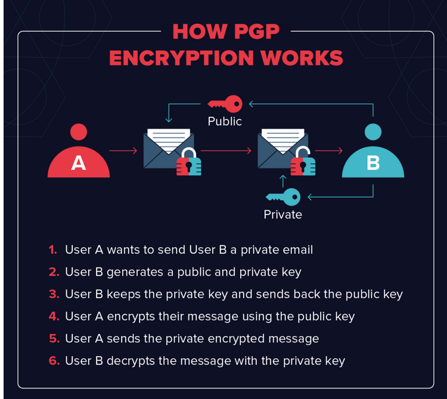

**1. Botnet ---> short for *'robot network'***
* A piece of malware that infects a computer to carry out commands under the remote control of the attacker
* Group of internet connected devices such as servers, PCs, mobile devices, etc that are affected and controlled by malware
* Used for stealing data, sending spam, performing DDoS attack and more, and also to enable the user to access the device and its connection 
* Under the control of a single attacking party, known as the **bot-herder or bot master**
* common botnet actions 
    * Email Spam
        * used for sending out spam messages , including malware 
        * **The Cutwail Botnet** can send up to 74 billion messages per day 

    * DDoS attacks
        * overload a target network or server with requests 
        * rendering it inaccessible to its intended users 

    * Financial breach 
        * Designed for the direct thefts of funds from enterprises and credit card information 
        * Financial botnets eg. **ZeuS botnet** 

    * Targeted intrusions 
        * smaller botnets designed to compromise specific high-value systems of organization from which attackers can penetrate and intrude further into the network 
        * attackers target their most valuable assets, including financial data, research and development, intellectual property and customer information 

* Created when the bot-herder sends the bot from his CC(command and control servers) to an unknowing recipient using file sharing, email, or social media application protocols 
* Once the recipient opens the malicious file on his computer, the bot reports back to command and control where the bot-herder can dictate commands to infected computers 

 

**2. Difference between hashing and enryption**

*Encryption*
* two way function where data is passed in as plaintext and comes out as ciphertext
* can be reversed or decrypted 
* process of encoding simple text and other information that can be accessed by the sole authorized entity if it has a decryption key 
* number of encryption systems:
    1. Asymmetric encryption : public-key encryption 
        * deploys two key public and private 
        * slower than symmetric encryption and consumes more processing power when encrypting data 
    2. Symmetric encryption: 
        * same secret key to encrypt and decrypt the message 
        * both sender and the receiver should have the key 
        * oldest technique of encryption 

**Purpose of Encryption**
* Protect data from an unauthorized person who wants to read or get the information 
* Confidentiality 
* Granular access control : user are limited to what they can see and do 
* Authentication: the origin of the message received can be traced 

Examples : AES is symmetric encryption, PGP is an example of an asymmetric encryption algorithm
    

*Hashing*
* also called **digest**
* a number generated from a string of text
* one way meaning the plaintext is scrambled into a unique digest through the use of a salt that cannot be decrypted 
* Technically hashing can be reversed but the computational power needed to decrypt it makes decryption infeasible 
* hashing will take arbitrary input and produce a string with a fixed length
* a hash algorithm is a function that can be used to map out data of random size to data of fixed size 
* hash values, hash codes and hash sums are returned by functions during hashing 

* **Types of hashing algorithms**
    * MD4 : Ronald Rivest , 128 bits length 
    * SHA Algorithm : Secure Hash Algorithm designed by NSA , 160 bits length, SHA, SHA-1, SHA-2 (256 bit) are different versions 
    * RIPMEND

**Purpose of hashing**
1. Compare large amount of data, it's easier comparing hashes than the data itself 
2. Used in Cryptographic applications like a digital signatures 
3. used to generate random strings to avoid duplication of data stored in databases 

**3. PGP :-Pretty Good Privacy -- Philip R. Zimmermann**
* Encryption program or application that implements the OpenPGP public key cryptography standard
* used to encrypt and decrypt email, authenticate messages with digital signatures  and encrypted stored files 
* Original PGP was offered in two versions :
    * Using the RSA for key exchange 
    * Using the Diffie-Hellman for key exchange 
* PGP concepts 
    * Alice and Bob 
    * Web of Trust 
    * Implict Trust : Alice has vetted Bob -- willing to assert (through her own signature) that she found Bob to be who he says he is and that the email and key pair are under Bob's control
    * Explict Trust: Occurs when Carlos, a third generic user is willing to trust Alice's judgement about other individuals 
    * Key Signing 
    * ASCII armor:- also known as Radix-64 encoding is a way of formatting encrypted data in a printable format 
    * Session Key : symmetric encryption key used for just one encryption session

* [Additional information](https://www.varonis.com/blog/pgp-encryption) 

**4.Radix -64 Encoding**
* Radix 64 or base 64 is a binary-to-text encoding system that is designed to allow binary data to be represented in ASCII string format 
* allows binary data stored in octets (i.e.bytes to be expressed as printable characters)
* requires the binary input to be split into block of 6
* which are then mapped onto a character set of printable characters 
* Radix-64 characterset includes 
    * A-Z
    * a-z
    * 0-9
    * the additional characters '+' and '/' 
* results in 33% more bytes -- every 3 input bytes is converted to 4 output 

**5. SSL/TLS**
**Secure Sockets Layer**
* standard technology for keeping an internet connection secure and safeguarding any sensitive data that is being sent between two systems 
* preventing adversary from reading and modifying any information transferred including personal details, payment information etc 
* Uses encryption algorithms to scramble data in transit 
* SSL is installed on the server side but there are visual cues on the browser 
    * https:// at the start of the web address 
* Certificate Authorities (CAs) can also authenticate the identity of the owner of website
    * Domain Validation Certificates : control over domain name
    * Organization Validation Certificates: not only domain name, prove that the company is registered and legally accountable as a business 
    * Extended Validation Certificates : 

**Transport Layer Security**
* Updated more secure version of SSL 
* most up tp date TLS certificates with the option of ECC, RSA or DSA encryption 

* Difference between SSL and TLS 

| SSL   |   TLS |
| ----- | ----- |
| supports the Fortezza algorithm | does not support the Fortezza algorithm|
| the message digest is used to create a master secret | a Pseudo-random function is used to create a master secret|
| Message Authentication Code protocol is used | Hashed Message Authentication Code Protocol is used |
| more complex than TLS | Simple |
| less secured | provides high security|
| less reliable and slower | highly reliable and upgraded, provides less latency |
| uses port to set up explicit connection | uses protocol to set up implicit connection| 

**6. How does SSL/TLS Encryption Work**
* Uses both asymmetric and symmetric encryption to protect the confidentiality and integrity of data-in-transit 
* asymmetric encryption is used to establish a secure session between client and a server 
* symmetric encryption is used to exchange data 
    * The client contact the server using a secure URL (Https)
    * server sends the client its certificate and public key 
    * client verifies this with a Trusted Root Certification Authority to ensure the certificate is legitimate 
    * client and server negotiate the strongest type of encryption that each can support 
    * client encrypts a session(secret) key with the server's public key and sends it back to the server 
    * the server decrypts the client communication with its private key and the session is established 
    * the session key(symmetric encryption) is now used to encrypt and decrypt data transmitted between the client and server 

* Both client and server are now using HTTPS(SSL/TLS + HTTP) for their communication 
