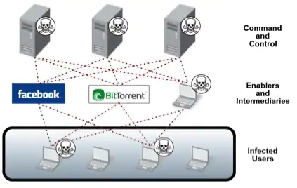
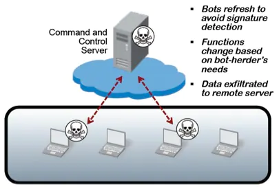

**1. Botnet ---> short for *'robot network'***
* A piece of malware that infects a computer to carry out commands under the remote control of the attacker
* Group of internet connected devices such as servers, PCs, mobile devices, etc that are affected and controlled by malware
* Used for stealing data, sending spam, performing DDoS attack and more, and also to enable the user to acess the device and its connection 
* Under the control of a single attacking party, known as the **bot-herder or bot master**
* common botnet actions 
    * Email Spam
        * used for sending out spam messages , including malware 
        * **The Cutwail Botnet** can send up to 74 billion messages per day 

    * DDoS attacks
        * overload a target network or server with requests 
        * rendering it inaccessible to its intended users 

    * Financial breach 
        * Designed for the direct thefts of funds from enterprises and credit card information 
        * Financial botnets eg. **ZeuS botnet** 

    * Targeted intrusions 
        * smaller botnets designed to compromise specific high-value systems of organization from which attackers can penetrate and intrude further into the network 
        * attackers target their most valuable assets, including financial data, research and development, intellectual property and customer information 

* Created when the bot-herder sends the bot from his CC(command and control servers) to an unknowing recipient using file sharing, email, or social media application protocols 
* Once the recipient opens the malicious file on his computer, the bot reports back to command and control where the bot-herder can dictate commands to infected computers 

 

**2. Difference between hashing and enryption**

*Encryption*
* two way function where data is passed in as plaintext and comes out as ciphertext
* can be reversed or decrypted 
* process of encoding simple text and other information that can be accessed by the sole authorized entity if it has a decryption key 
* number of encryption systems:
    1. Asymmetric encryption : public-key encryption 
        * deploys two key public and private 
        * slower than symmetric encryption and consumes more processing power when encrypting data 
    2. Symmetric encryption: 
        * same secret key to encrypt and decrypt the message 
        * both sender and the receiver should have the key 
        * oldest technique of encryption 

**Purpose of Encryption**
* Protect data from an unauthorized person who wants to read or get the information 
* Confidentiality 
* Granular access control : user are limited to what they can see and do 
* Authentication: the origin of the message received can be traced 

Examples : AES is symmetric encryption, PGP is an example of an asymmetric encryption algorithm
    

*Hashing*
* also called **digest**
* a number generated from a string of text
* one way meaning the plaintext is scrambled into a unique digest through the use of a salt that cannot be decrypted 
* Technically hashing can be reversed but the computational power needed to decrypt it makes decryption infeasible 
* hashing will take arbitrary input and produce a string with a fixed length
* a hash algorithm is a function that can be used to map out data of random size to data of fixed size 
* hash values, hash codes and hash sums are returned by functions during hashing 

* **Types of hashing algorithms**
    * MD4 : Ronald Rivest , 128 bits length 
    * SHA Algorithm : Secure Hash Algorithm designed by NSA , 160 bits lenght, SHA, SHA-1, SHA-2 (256 bit) are different versions 
    * RIPMEND

**Purpose of hashing**
1. Compare large amount of data, it's easier comparing hashes than the data itself 
2. Used in Cryptographic applications like a digital signatures 
3. used to generate random strings to avoid duplication of data stored in databases 

